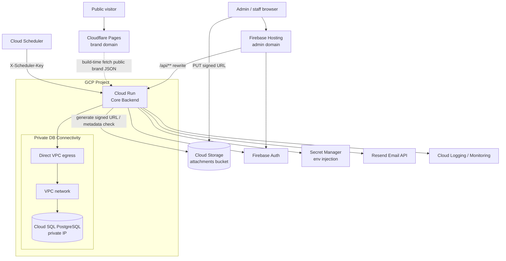
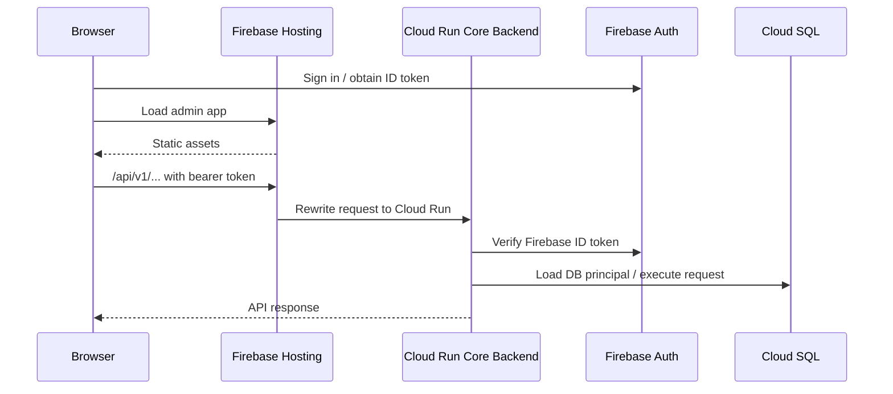
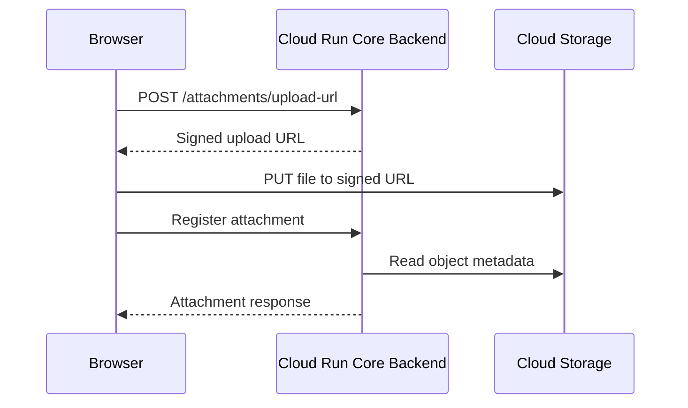
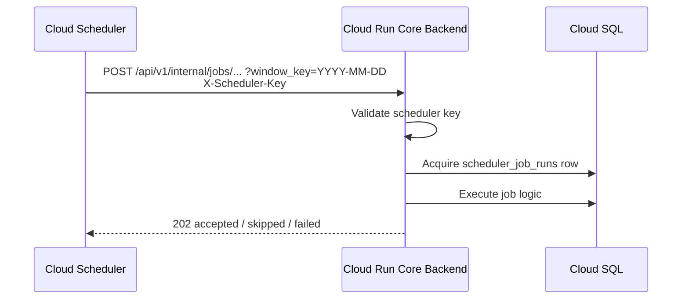

# STDS Cloud Architecture

Project: STDS - Property Management System
Version: 1.0
Status: Proposed baseline for staging; production use requires a separate
production readiness review.

## Overview

STDS runs on GCP using Firebase Hosting, Cloud Run, Cloud SQL, Secret Manager,
Cloud Storage, Cloud Scheduler, and Cloud Logging / Monitoring. The public
brand frontend is deployed separately on Cloudflare Pages.

This document is the deployment architecture baseline for the staging line and
the early production candidate. It intentionally avoids an external Application
Load Balancer in the first version. Firebase Hosting is the browser-facing edge
for the admin frontend, Cloudflare Pages is the browser-facing edge for the
brand frontend, and Cloud Run hosts the core backend service.

Cloud SQL private IP and Cloud Run Direct VPC egress are included in staging v1.
This is a security hardening choice because legacy property data will be
migrated early. It is not treated as an HTTP ingress boundary.

## Core Decisions

### No External Application Load Balancer In The First Version

Firebase Hosting handles admin browser-facing TLS, custom domains, CDN
behavior, and admin API rewrites. Cloudflare Pages handles the public brand
site. API security remains enforced by Firebase Auth, DB-backed authorization,
service account IAM, and scheduler keys.

An external Application Load Balancer is a future option for a stronger
production edge, Cloud Armor, host/path routing across many services, WAF,
rate limiting, or strict Cloud Run ingress through the load balancer. It is out
of scope for the staging deployment line.

### Browser-To-Backend Calls

Admin frontend browser calls should use Firebase Hosting rewrites where
practical:

- admin frontend: `/api/**` to the core backend Cloud Run service.

The brand frontend is a Cloudflare Pages static site. It fetches public brand
data at build time from core backend public read-only endpoints and does not
require a Firebase Hosting brand rewrite or separate brand backend runtime.

The Cloud Run `run.app` URL is not part of the browser-facing contract. Whether
the default `run.app` URL can be disabled safely is a separate hardening
decision and must be verified before relying on it. Firebase Hosting rewrites
must be tested against the chosen Cloud Run ingress/default-URL settings.

### VPC With Direct VPC Egress For Cloud SQL

Cloud Run services should connect to Cloud SQL through private IP using Direct
VPC egress if the staging operator accepts the added setup complexity.

Direct VPC egress is preferred over Serverless VPC Access connector for this
project because it avoids fixed connector VM cost and scales with Cloud Run
traffic. The tradeoff is extra networking setup and a more complex migration /
operator access path.

VPC/private IP is used for backend-to-database connectivity. It is not the
browser ingress boundary.

### One Cloud SQL Instance, Separate Databases

The cost-conscious baseline is one Cloud SQL PostgreSQL instance with separate
databases:

- `stds_staging`
- `stds_production`

Each environment uses a separate DB credential scoped to its own database.

This is an accepted cost tradeoff, not a hard security boundary. Staging and
production share instance-level CPU, memory, connection, maintenance, and
availability behavior. A staging migration, bad query, or connection spike can
affect the shared instance. If this risk becomes unacceptable, split staging and
production into separate Cloud SQL instances.

### Brand Public Read Boundary

The brand site reads data through dedicated public read-only core backend
endpoints. These routes must live under an independent public namespace, remain
separate from authenticated admin brand management endpoints, and query only
approved read-only views:

- `approved_brand_profile_v1`
- `approved_brand_faq_items_v1`
- `approved_brand_property_availability_v1`

The first version intentionally uses the core backend runtime DB credential for
these low-traffic build-time reads. This avoids the operational cost of a
separate brand Cloud Run service and readonly credential while keeping approved
views as the public data exposure boundary. Public handlers must not query core
base tables such as tenants, leases, bills, deposits, accounting, attachments,
or operational property/room tables directly.

### Explicit DB Connection Pool Limits

Cloud Run can scale horizontally. Each instance owns its own DB connection
pool, so small Cloud SQL instances can hit connection pressure before CPU
becomes the bottleneck.

The runtime should support environment-controlled pool settings:

```text
DB_MAX_OPEN_CONNS
DB_MAX_IDLE_CONNS
DB_CONN_MAX_LIFETIME
```

The Go runtime reads these values from the environment and applies them to the
`database/sql` pool when opening the PostgreSQL connection.

Initial target values:

```text
staging:
  DB_MAX_OPEN_CONNS=5
  DB_MAX_IDLE_CONNS=2
  DB_CONN_MAX_LIFETIME=5m

production candidate initial:
  DB_MAX_OPEN_CONNS=5
  DB_MAX_IDLE_CONNS=2
  DB_CONN_MAX_LIFETIME=5m
```

The actual Cloud SQL `max_connections` value must be verified on the created
instance, for example through `pg_settings`, instead of being hardcoded in this
document.

## Architecture

### High-Level Runtime



### Browser API Flow



### Attachment Upload Flow



GCS is not routed through VPC or Firebase Hosting. Browser upload uses scoped
signed URLs. The bucket CORS policy must allow only approved frontend origins.

### Scheduler Flow



All browser traffic enters through Firebase Hosting. Cloud Scheduler is not
browser traffic and may call scheduler endpoints directly.

## Service Responsibilities

### Core Backend

- Serves admin APIs.
- Validates Firebase Auth bearer tokens.
- Resolves DB-backed user principal.
- Enforces RBAC and property-scoped middleware.
- Executes scheduler jobs.
- Generates GCS signed URLs and checks attachment metadata.
- Dispatches transactional email through Resend.
- Connects to Cloud SQL through the chosen private connectivity path.
- Receives secrets through Cloud Run environment variables backed by Secret
  Manager.
- Starts with `max-instances=2` to bound DB connection pressure.

### Public Brand Endpoints

- Serve public brand and property availability JSON for Cloudflare Pages
  build-time fetches.
- Live under an independent public namespace.
- Do not require Firebase JWT.
- Read approved views only.
- Use the core backend runtime DB credential in the first version.

### Firebase Hosting

- Hosts admin frontend.
- Provides custom domains and TLS for browser traffic.
- Rewrites admin API paths to the core backend Cloud Run service.
- Does not replace backend authentication or authorization.

### Cloudflare Pages

- Hosts the public brand frontend.
- Provides branch and pull-request preview deployments.
- Builds static Astro output into `dist`.
- Fetches public brand data from core backend public read-only endpoints at
  build time.
- Can be rebuilt on a schedule through a protected Pages deploy hook.

### Cloud SQL

- PostgreSQL.
- Target machine type for the cost-conscious production candidate:
  `db-g1-small`.
- `db-f1-micro` remains acceptable for staging or low-risk demo environments,
  but `db-g1-small` is preferred for early production candidate stability.
- Daily automated backups.
- Seven-day backup retention.
- PITR enabled for production before go-live; optional for staging.
- No HA in the first version unless a production uptime requirement is
  accepted.

### Secret Manager

Secret Manager is the source of runtime secret values. Cloud Run injects those
secrets into environment variables where the current Go runtime reads them.
Application code should not require direct Secret Manager API calls for the
first version.

Secret values must never be committed or printed in logs.

## Observability

### Logging

Cloud Run automatically sends stdout/stderr, request logs, and system logs to
Cloud Logging. The current Go runtime uses structured JSON logging with
`log/slog`.

Important fields:

- `request_id`
- `user_id` when available
- `property_id` when available
- `method`
- `path`
- `status`
- `latency_ms`
- scheduler `job_key`
- scheduler `job_window_key`
- scheduler `job_status`
- scheduler `job_retry_count`
- scheduler `job_duration_ms`

Do not log bearer tokens, scheduler keys, DB passwords, private keys, or full
request/response bodies containing sensitive data.

The operator-facing filters, metric checks, alert expectations, and evidence
format live in `docs/staging-runbook.md`.

### Monitoring

Use GCP-native monitoring in the first version. Do not introduce Prometheus or
Grafana for staging.

Baseline metrics:

- Cloud Run request count.
- Cloud Run latency.
- Cloud Run 5xx/error count.
- Cloud Run instance count.
- Cloud SQL CPU.
- Cloud SQL connection count.
- Cloud SQL storage usage.

Baseline alerts:

- Cloud Run service unavailable.
- Elevated Cloud Run 5xx/error count.
- Cloud Run instance count reaches `max-instances`.
- Cloud SQL CPU over threshold.
- Cloud SQL connection count approaching actual `max_connections`.
- Cloud SQL disk usage over threshold.
- Billing budget alert.

Log-based metrics are optional for staging. If added, keep them narrow:

- scheduler failed results.
- auth validation failures.
- signed URL generation count.

## Security Posture

No single layer is the only security boundary.

| Layer | Control |
| --- | --- |
| Network | Cloud SQL private IP; no public DB endpoint in the target architecture. |
| Browser ingress | Firebase Hosting for admin; Cloudflare Pages for public brand. |
| Authentication | Firebase Auth bearer token on admin APIs. |
| Authorization | DB-backed principal, RBAC, and property-scoped middleware. |
| Brand data boundary | Core public read-only endpoints over approved views only. |
| Secrets | Secret Manager values injected into Cloud Run env vars. |
| Storage | Browser receives scoped signed URLs, not broad GCS credentials. |
| Scheduler | `X-Scheduler-Key` for internal job endpoints. |
| IAM | Separate Cloud Run service accounts with least privilege. |

Accepted tradeoffs:

| Tradeoff | Rationale |
| --- | --- |
| No external Application Load Balancer | Current scale does not justify cost or operational complexity. |
| No Cloud Armor / WAF | Revisit when public abuse or stronger production edge controls are needed. |
| One Cloud SQL instance for staging and production | Cost-conscious choice; instance-level resource contention is accepted initially. |
| No separate brand thin backend | Brand site is static, has no booking/write flow, and accepts build-time freshness; the extra Cloud Run service and readonly credential are retired. |
| No HA in first version | Acceptable until a production uptime SLA is required. |
| Cloud Run default URL disabling is not assumed | Hosting rewrites hide the URL from browser contracts, but default URL hardening must be verified separately. |

## Cost Baseline

Approximate low-traffic monthly cost:

| Component | Monthly estimate |
| --- | --- |
| Cloud SQL `db-g1-small` | 25-30 USD |
| Cloud SQL storage / backups | 2-5 USD |
| Cloud Run | 0-2 USD |
| Firebase Hosting | 0 USD in free-tier scale |
| Cloudflare Pages | 0 USD in free-tier scale |
| Secret Manager | 0-1 USD at current scale |
| Cloud Storage attachments | 0-1 USD initially |
| Direct VPC egress | traffic-proportional; expected low at current scale |
| Cloud Logging / Monitoring | 0-2 USD if logs stay modest |
| Cloud Scheduler | about 0.30 USD for six jobs after free jobs |

Cloud SQL is expected to dominate the cost profile. Cost assumptions must be
verified with GCP Billing and the Pricing Calculator before production go-live.

## Deployment Phases

### Staging v1

- Firebase Hosting admin frontend.
- Cloud Run core backend.
- Cloud SQL private IP with VPC / Direct VPC egress.
- Secret Manager env injection.
- GCS signed URL upload.
- Cloud Logging / Monitoring baseline.
- Cloud Run `max-instances=2`.
- DB pool limits implemented and configured.
- Staging database preparation uses a local operator plain SQL dump from
  `scripts/prepare_legacy_db_dump.sh`, manual GCS upload, Cloud SQL
  Console/manual import, and first admin Firebase/backend user alignment.
- Smoke checks for deployment, database preparation, Firebase Auth, signed URL
  upload, and log visibility.
- Cloud Scheduler jobs are excluded from the first staging demo wave.
- Cloudflare Pages brand frontend deployment is a separate repository follow-up;
  only the core public brand endpoints belong to this backend contract.
- Deployment starts from the backend `staging` branch as the deployment-intent
  branch. Promotion is normally `dev` to `staging` by pull request. A `staging`
  branch push runs GitHub Actions predeploy checks, waits for GitHub `staging`
  Environment approval, then submits Cloud Build for image build, Artifact
  Registry push, and Cloud Run deploy. Manual workflow dispatch remains as a
  controlled operator rerun path. The GitHub deploy service account also reads
  the current Cloud Run traffic split before deploy and can update staging
  traffic for smoke-failure rollback; missing `run.services.get` or
  `run.services.update` blocks the workflow before or during rollback. The
  rollback traffic update also requires staging Artifact Registry image read and
  narrow act-as permission on the Cloud Run runtime service account.

### Production Readiness Review

Before production go-live:

- Confirm Cloud SQL machine type.
- Confirm backup window and PITR.
- Confirm whether HA is required.
- Confirm DB pool limits under realistic load.
- Confirm the operator Cloud SQL manual import and post-import inspection path.
- Confirm operator DB access path without public DB IP.
- Confirm whether the local dump/manual import flow remains sufficient after the
  first staging demo wave.
- Confirm Firebase Hosting admin rewrite behavior and whether Cloud Run default
  URL disabling is safe.
- Confirm Cloudflare Pages branch/preview/prod environment variables and deploy
  hook protection.
- Confirm GCS CORS for production frontend origins.
- Confirm Cloud Monitoring alert policies and billing budgets.

## Repo Impact

Expected repo changes for this architecture:

- Dockerfile and `.dockerignore`.
- Cloud Build staging deployment config.
- GitHub Actions trigger/status workflow if needed.
- Staging database preparation runbook covering local dump generation, manual
  GCS upload, Cloud SQL import, validation evidence, and first admin bootstrap.
- DB pool config support.
- Staging smoke script.
- Core public brand endpoint implementation and brand Pages deployment notes.
- Deployment runbooks and verification evidence templates.

Application domain logic should not need broad runtime changes for the staging
deployment line.

## Open Decisions

- Should staging and production share one Cloud SQL instance initially?
- How long should staging rely on local dump generation plus Cloud SQL manual
  import before introducing a controlled migration/import runner?
- How will operators inspect the database without enabling public IP?
- Should the legacy dump/import artifact retention policy be stricter after the
  first demo wave?
- Should production require Cloud SQL HA before go-live?
- Should Cloud Run default `run.app` URLs be disabled, and does that work with
  the selected Firebase Hosting admin rewrite path?
